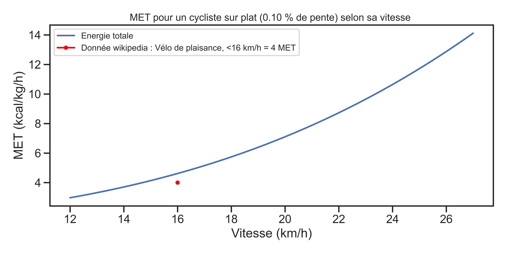
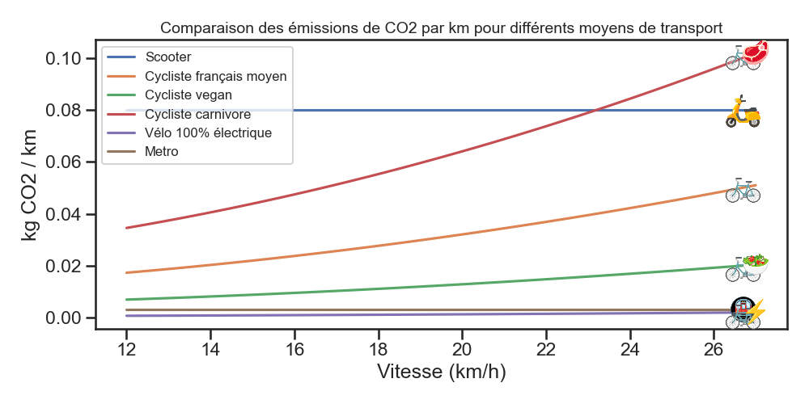
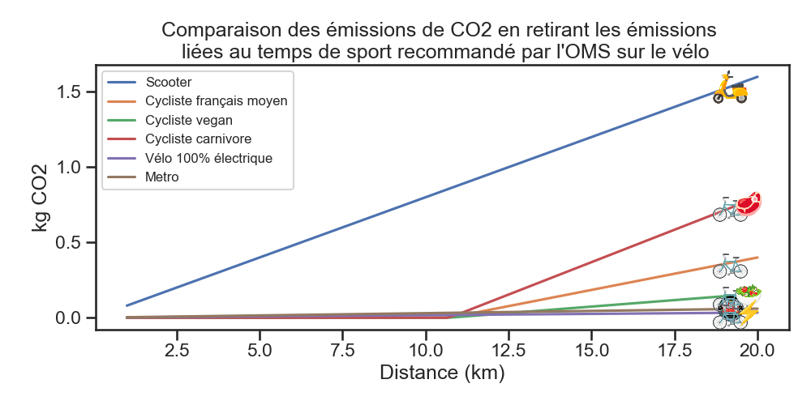

# Émission CO2 vélo via la nourriture consommée par le cycliste

Dernièrement, j'ai été surpris par l'émission de C02 d'un cycliste donné dans certaines sources (dont un papier Nature) :

 - https://www.nature.com/articles/s41598-020-66170-y
 - https://www.auto-moto.com/actualite/environnement/lautomobile-plus-ecolo-que-le-velo-31204.html
 - https://twitter.com/HugoMe/status/1448047429912342531

La plupart part de la consommation d'un cycliste mesuré par la science du sport. Une valeur typique, selon l'intensité du cycliste, se situe de 4 à 8 MET. Ou 1 MET (Metabolic equivalent of task) = 1 kcal / (kg * h) correspond à la consommation au repos d'un humain par kilogrammes et heure. [wiki](https://fr.wikipedia.org/wiki/%C3%89quivalent_m%C3%A9tabolique). 

Par exemple, en prenant un MET de 8 pour 30 min de vélo pour une personne de 80 kg, on trouve $E_{depensee} = 8 * 80 / 2 = 320 kcal$. J'ai été très surpris par cette valeur qui correspond à manger 1/3 en plus (ref 1800 kcal) après 30 min de vélo. Donc, j'ai décidé de retrouver cette valeur avec une description physique d'un homme sur un vélo.

## Description 

Rapidement, je considère la variation d'énergie cinétique, potentiel de pesanteur, travail des forces de frottement de l'air et de la résistance au roulement. Ce qui donne, en supposant la vitesse constante :

$$E_{tot} = \frac{n_{stop}}{2} m v^2 + m g z + R_t v^2 L + C_{rr} m g L$$

ou $n_{stop}$ est le nombre de fois ou on s'arrete lors du trajet, $L$ la longeur du trajet, $R_t$ un coefficient prenant en compte le frottement de l'air, et $C_{rr}$ le coefficient de résistance au roulement. Plus de détails sur le choix des valeurs dans le code :

```
m = 85 # kg masse cycliste + velo
delta_h = 10 # m dénivelé
L = 10000 # m distance parcourue

C_rr = 0.005 # FR = Crr⋅m⋅g  https://fr.wikipedia.org/wiki/R%C3%A9sistance_au_roulement  https://www.velomobil.ch/ch/sites/default/files/images/pages/reifenpruefstand/diagramm_cr_v.jpg
R_t = 0.4 # F = R_T v^2 https://pubmed.ncbi.nlm.nih.gov/468661/ le papier donne 0.2 pour un velo de route. Je prend *2 pour un velo de ville
g = 9.81 # m/s^2
Nombre_d_arret = 4 ## On suppose que le cycliste s'arrete 4 fois et doit donc fournir 4 fois l'enegie cinetique

E_eff = 0.2 # Rendement energétique cycliste https://en.wikipedia.org/wiki/Bicycle_performance or https://pubmed.ncbi.nlm.nih.gov/468661/
food_kgC02_kcal_vegan = 0.6/1000 # https://ourworldindata.org/grapher/ghg-kcal-poore
food_kgC02_kcal_moyen = 1.5/1000 # fig 2 de https://www.connaissancedesenergies.org/sites/default/files/pdf-actualites/etude-cas-impact-carbone-regimes-alimentaires-differencies-2011.pdf
food_kgC02_kcal_boeuf = 3/1000 # fig 2 de https://www.connaissancedesenergies.org/sites/default/files/pdf-actualites/etude-cas-impact-carbone-regimes-alimentaires-differencies-2011.pdf

E_velo_electrique = 0.4 # Rendement vélo 100% électrique à la louche
Electricite_kgC02_jool = 0.1 / (1000 * 60 * 60)  # Electricité francaise kgC02/kwh https://app.electricitymaps.com/zone/FR
```

## Simulation MET avec ce modèle


Ce modèle semble cohérent avec une donnée de https://fr.wikipedia.org/wiki/%C3%89quivalent_m%C3%A9tabolique. Avec celui-ci, on obtient un MET de 5 pour 20 km/h. Pour obtenir un MET de 8 à 20 km/h, il faudrait avoir une pente de 1% (soit 100m de dénivelé sur 10km).

## Comparaison des émissions de CO2 par km pour différents moyens de transport



Dans cette approche, on considère pour le vélo uniquement les émissions liées à la consommation de nourriture nécessaire à faire avancer le vélo. Pour le scooter et le métro, l'ensemble du cycle de vie est considérée (donnée ADEME https://datagir.ademe.fr/apps/mon-impact-transport/). Avec cette approche, le métro et le vélo 100% électrique (sans aucun éffort du cycliste) sont très proches et imbatable ! Plus de détail dans le graphe en [log](./results/C02_km_log.png)

## Comparaison des émissions de CO2 en retirant les émissions liées au temps de sport recommandé par l'OMS sur le vélo
L'OMS recommande de faire entre 150-300 minutes de sport à intensité modéré par semaine (https://www.who.int/news-room/fact-sheets/detail/physical-activity). Ce qui nous donne, en moyenne, 225/7 = 32 minutes de sport par jours pour être en bonne santé. En supposant qu'un cycliste ne fait pas de sport en plus que lors de ses déplacements, on peut enlever le C02 correspondant à ses 32 premières minutes de trajet. Donc pour un cycliste roulant à 20km/h, nous obtenons :



Plus de détail dans le graphe en [log](./results/Emmission_C02_distance_avec_sport_OMS_log.png).

Avec cette approche, on comprend mieux pourquoi l'ADEME a choisi de donner une empreinte carbone nulle au déplacement à vélo (https://datagir.ademe.fr/apps/mon-impact-transport/). Ce qui est valable pour des distances journalières inférieures à environ 10-14 km.

